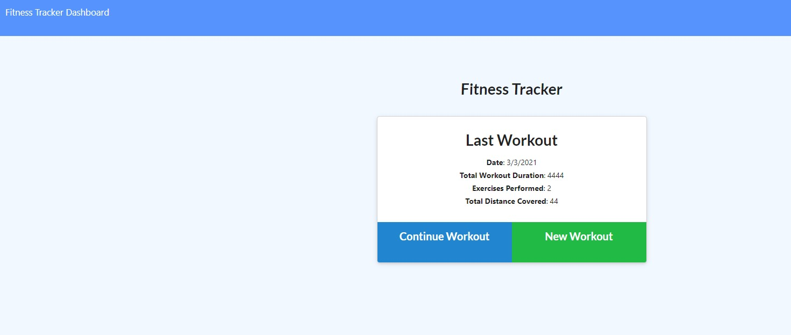
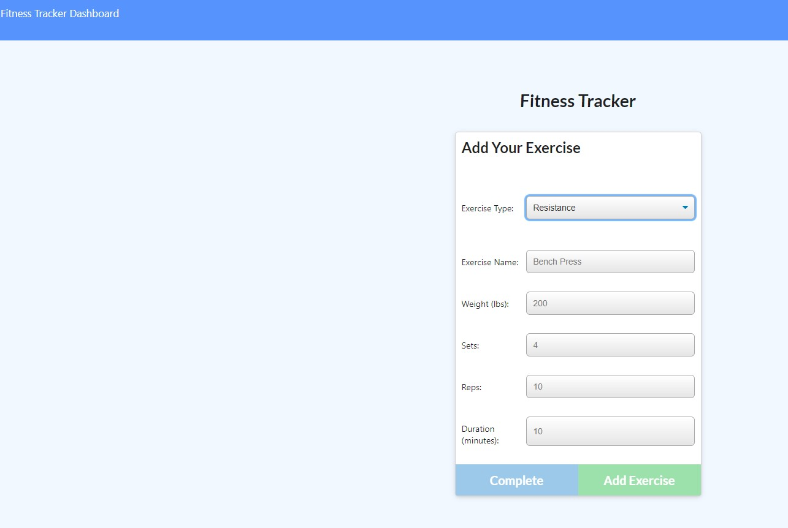

# Workout Tracker
Full-stack app using `node`, `express`, `MongoDB`, and `Mongoose`.
  
## Description
Workout-Tracker provides the user with plenty of functionality to help them reach their fitness goals. Users are able to...
* Log multiple exercises in a workout
* Track the name, type, weight, sets, reps, and duration of each exercise
* Track the distance traveled if the exercise was cardio based
* View past workouts

## Installation

* Users can view the deployed project . If you intend to iterate on the project, besides downloading the repo to your machine, be sure to run `npm i` in the root directory and to also have MongoDB installed and ready.

## Usage
* View the deployed app [here](https://wout-tracker.herokuapp.com/) and use the app.

## Images

